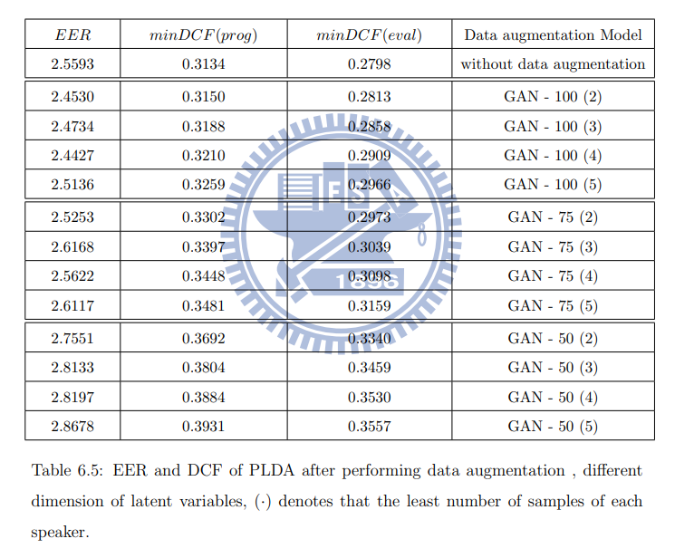

# Variational Bayesian GAN for Speaker-Recognition
## NIST i-vector machine learning challenge
* 4958 speakers NIST i-vector
* We counted the number of samples of each speaker that is less than n in the dataset where n range from 2 to 10. The table 6.3 shows the result. We can find out there is one fifth of speakers with one sample. The dataset is unbalanced.
* if the number of sample of each speaker is less than n, we will supplement the number of sample of each speakers to n where n range from 2 to 5

  

## Experimental Results
The table 6.4 and Table 6.5 show the evaluation on PLDA with different dimension of latent variable after performing data augmentation.

  
  

* We find that the improvements of our proposed are batter than the  improvements of vanilla GAN after data augmentation. However, there is a strange phenomenon when the added sample increase, the VBGAN can not provide the improvement for PLDA. The reason may be that the augmented data in each speakers are lack of diversity, so that the model is too consistent with some feature of speaker.

  

